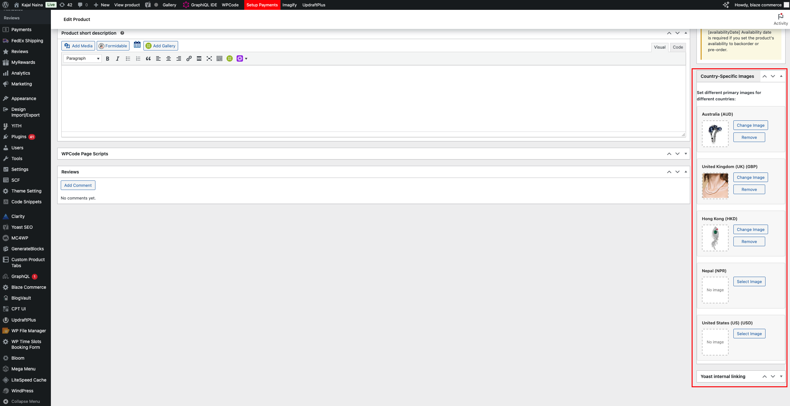

# Country-Specific Images Feature

> Display different product images based on customer location using Aelia Currency Switcher integration.

## 🌍 Overview

The Country-Specific Images feature allows WooCommerce store owners to set different primary product images for different countries. This is particularly useful for:

- **Regional Product Variations** - Show region-appropriate product images
- **Cultural Customization** - Display culturally relevant imagery
- **Localized Marketing** - Tailor product presentation by geography
- **Multi-Market Stores** - Manage global product catalogs efficiently

## ✨ Key Features

- 🎯 **Automatic Country Detection** - Uses Aelia Currency Switcher for seamless country identification
- 🖼️ **WordPress Media Integration** - Familiar media library interface for image selection
- 🔄 **Typesense Sync** - Automatically pushes data to Typesense search index
- 📱 **Responsive Admin UI** - Clean, mobile-friendly admin interface
- 🛡️ **Graceful Fallbacks** - Shows default image when country-specific image isn't available
- ⚡ **Performance Optimized** - Minimal overhead, only processes when needed
- 🧪 **Built-in Testing** - Comprehensive test suite for easy verification

## Table of Contents

- [Requirements](#requirements)
- [Installation & Setup](#installation--setup)
- [How It Works](#how-it-works)
- [Configuration](#configuration)
- [Usage](#usage)
- [Testing](#testing)
- [Typesense Integration](#typesense-integration)
- [Technical Implementation](#technical-implementation)
- [Troubleshooting](#troubleshooting)
- [API Reference](#api-reference)
- [Best Practices](#best-practices)
- [Support](#support)

## 🚀 Quick Start

### Prerequisites
```bash
# Required plugins
✅ WooCommerce
✅ Aelia Currency Switcher
✅ Blaze Commerce
```

### 1. Enable Feature
1. Go to **Blaze Commerce → Settings → General**
2. Check **"Enable Country-Specific Product Images"**
3. Save settings

### 2. Configure Product Images
1. Edit any WooCommerce product
2. Find **"Country-Specific Images"** meta box
3. Select images for different countries
4. Save product

### 3. Verify Setup
1. Go to **Tools → Test Country Images**
2. Review test results
3. Ensure all tests pass

## Requirements

### Required Plugins
- **WooCommerce** - For product management
- **Aelia Currency Switcher** - For country/currency mappings
- **Blaze Commerce** - Base plugin (this feature is an extension)

### WordPress Requirements
- WordPress 5.0 or higher
- PHP 7.4 or higher

## Installation & Setup

### 1. Enable the Feature

1. Navigate to **WordPress Admin → Blaze Commerce → Settings → General**
2. Locate the **"Enable Country-Specific Product Images"** checkbox
   - ⚠️ This option only appears if Aelia Currency Switcher is active
3. Check the box to enable the feature
4. Click **"Save Changes"**

### 2. Configure Aelia Currency Switcher

Ensure your Aelia Currency Switcher is properly configured with:
- Multiple currencies enabled
- Country mappings for each currency
- Proper region settings

## How It Works

### Country Detection Flow

The system determines the current country using the following priority:

1. **Selected Currency** - From Aelia Currency Switcher cookie (`aelia_cs_selected_currency`)
2. **WooCommerce Customer Data** - Billing or shipping country
3. **Aelia GeoIP Detection** - Automatic location detection
4. **Fallback** - Default product image if no country-specific image is available

### Image Selection Logic

```
Customer visits product page
    ↓
System detects customer's country
    ↓
Check if country-specific image exists for this product
    ↓
Display country-specific image OR fallback to default image
```

## Configuration

### Setting Up Country-Specific Images

1. **Edit a Product**
   - Go to **Products → All Products**
   - Click **Edit** on any product

2. **Locate the Meta Box**
   - Look for **"Country-Specific Images"** meta box in the sidebar
   - If not visible, check **Screen Options** at the top and enable it

3. **Configure Images**
   - Each available country from your Aelia configuration will be listed
   - Click **"Select Image"** for any country
   - Choose an image from the WordPress Media Library
   - Click **"Use this image"**

4. **Save the Product**
   - Click **"Update"** to save your changes

### Available Countries

The countries shown are automatically pulled from your Aelia Currency Switcher configuration. Each country displays as:

```
Country Name (Currency Code)
Example: United States (USD), Australia (AUD)
```

## Usage

### Admin Interface



The admin interface provides:
- **Country List** - All countries from Aelia configuration
- **Image Preview** - Thumbnail of selected image
- **Select/Change Image** - WordPress media library integration
- **Remove Image** - Clear country-specific image

### Frontend Behavior

- **Automatic Detection** - Images change based on customer's country
- **Seamless Fallback** - Default image shown if no country-specific image exists
- **Currency Switching** - Images update when customer changes currency
- **Performance Optimized** - Only loads necessary image data

## 🧪 Testing

### Built-in Test Suite

The plugin includes a comprehensive test suite for easy verification and troubleshooting.

#### Quick Access
1. **WordPress Admin → Tools → Test Country Images**
2. **No configuration required** - works out of the box
3. **Instant results** - see all test results in one page

#### Alternative Access Methods

**Method 1: Admin Menu (Recommended)**
- Navigate to **Tools → Test Country Images**
- Clean interface with formatted output
- No additional setup required

**Method 2: Debug Mode**
- Add to `wp-config.php`: `define('WP_DEBUG', true);`
- Test file automatically loaded
- Access via admin menu

**Method 3: Direct URL**
- Visit: `/wp-admin/tools.php?page=test-country-images`
- Requires admin privileges

#### Test Coverage - 10 Comprehensive Tests

1. **✅ Extension Class Loading** - Verifies CountrySpecificImages class exists
2. **✅ Aelia Currency Switcher Integration** - Checks plugin dependency
3. **✅ Settings Filter Registration** - Tests filter-based settings approach
4. **✅ Feature Settings** - Verifies if feature is enabled in settings
5. **✅ Extension Instance Creation** - Tests singleton pattern implementation
6. **✅ Asset File Existence** - Checks JavaScript and CSS files
7. **✅ Available Countries Detection** - Tests Aelia country mappings
8. **✅ Sample Product Testing** - Tests with real product data
9. **✅ Typesense Filter Integration** - Verifies data processing for Typesense
10. **✅ Expected Data Structure** - Shows example output format

#### Sample Test Output

```
Testing Country-Specific Images Extension

1. Extension Class Test
✅ CountrySpecificImages class exists

2. Aelia Currency Switcher Test
✅ Aelia Currency Switcher is active

3. Settings Filter Test
✅ Country-specific images setting is registered via filter

4. Feature Settings Test
⚠️ Country-specific images feature is disabled
Enable it in Blaze Commerce > Settings > General > Enable Country-Specific Product Images

5. Extension Instance Test
✅ Extension instance created successfully

6. Assets Test
✅ JavaScript file exists
✅ CSS file exists

7. Available Countries Test
✅ Found 12 countries in Aelia configuration

8. Sample Product Test
✅ Found sample product: Sample Product (ID: 123)
ℹ️ Product has no country-specific images configured (normal for new installations)

9. Typesense Filter Integration Test
✅ add_country_images_to_typesense method exists

10. Expected Typesense Data Structure
When country-specific images are configured, the Typesense data will include:
metaData: {
  primaryImages: {
    'AU': 'https://example.com/wp-content/uploads/2024/01/australia-image.jpg',
    'US': 'https://example.com/wp-content/uploads/2024/01/usa-image.jpg',
    'GB': 'https://example.com/wp-content/uploads/2024/01/uk-image.jpg'
  }
}

Test Summary
Country-Specific Images extension test completed.
If all tests pass and the feature is enabled, you should see the meta box on product edit pages.
```

#### Interpreting Test Results

| Symbol | Meaning | Action Required |
|--------|---------|-----------------|
| ✅ | **Success** - Feature working correctly | None |
| ⚠️ | **Warning** - Feature available but not enabled/configured | Review configuration |
| ❌ | **Error** - Issue that needs resolution | Fix the problem |
| ℹ️ | **Info** - Normal informational message | None |

#### Common Test Scenarios

**Fresh Installation:**
```
✅ CountrySpecificImages class exists
⚠️ Aelia Currency Switcher is not active
⚠️ Country-specific images feature is disabled
```
*Action: Install Aelia Currency Switcher, enable feature*

**Properly Configured:**
```
✅ CountrySpecificImages class exists
✅ Aelia Currency Switcher is active
✅ Country-specific images feature is enabled
✅ Found 12 countries in Aelia configuration
```
*Action: Ready to use! Configure product images*

## Typesense Integration

### Data Structure

Country-specific images are automatically pushed to Typesense with the following structure:

```json
{
  "id": "123",
  "name": "Sample Product",
  "metaData": {
    "primaryImages": {
      "AU": "https://example.com/wp-content/uploads/australia-image.jpg",
      "US": "https://example.com/wp-content/uploads/usa-image.jpg",
      "GB": "https://example.com/wp-content/uploads/uk-image.jpg"
    }
  }
}
```

### Automatic Sync

- **Product Save** - Data syncs when product is saved
- **Bulk Sync** - Included in bulk product synchronization
- **Real-time Updates** - Changes reflect immediately in Typesense

### Frontend Usage

Access country-specific images in your frontend application:

```javascript
// Get primary images object
const primaryImages = product.metaData.primaryImages;

// Get image for specific country
const countryImage = primaryImages[customerCountry] || product.thumbnail.src;

// Example usage
const currentImage = primaryImages['AU'] || product.thumbnail.src;
```

## 🛠️ Technical Implementation

### Architecture Overview

The feature is implemented as a WordPress extension that integrates with the Aelia Currency Switcher plugin to provide region-specific product imagery.

### Core Components

#### Extension Class
**File**: `app/Extensions/CountrySpecificImages.php`

```php
class CountrySpecificImages {
    // Singleton pattern implementation
    private static $instance = null;

    public static function get_instance() {
        if (self::$instance === null) {
            self::$instance = new self();
        }
        return self::$instance;
    }
}
```

#### Filter Integration

```php
// Settings registration
add_filter('blaze_wooless_general_settings', array($this, 'add_country_images_setting'), 10, 1);

// Frontend image filtering
add_filter('wooless_product_thumbnail', array($this, 'get_country_specific_thumbnail'), 10, 2);

// Typesense data integration
add_filter('blaze_wooless_product_data_for_typesense', array($this, 'add_country_images_to_typesense'), 10, 3);
```

#### Admin Interface

**Meta Box Registration:**
```php
add_action('add_meta_boxes', array($this, 'add_country_images_meta_box'));

public function add_country_images_meta_box() {
    add_meta_box(
        'blaze-country-images',
        'Country-Specific Images',
        array($this, 'render_country_images_meta_box'),
        'product',
        'side',
        'default'
    );
}
```

**Data Persistence:**
```php
add_action('woocommerce_process_product_meta', array($this, 'save_country_images_meta'));
```

### Data Flow

#### Admin Configuration Flow
```
User selects image → JavaScript handles media library →
AJAX saves to hidden input → Form submission →
PHP processes and saves to post meta
```

#### Frontend Display Flow
```
Page request → Country detection →
Check for country-specific image →
Return appropriate image URL → Display
```

#### Typesense Sync Flow
```
Product save/sync trigger → Filter hook fired →
Retrieve country images → Convert IDs to URLs →
Add to metaData.primaryImages → Sync to Typesense
```

### Country Detection Algorithm

```php
private function get_current_country() {
    $country = null;

    // Priority 1: Selected currency cookie
    if (isset($_COOKIE['aelia_cs_selected_currency'])) {
        $selected_currency = sanitize_text_field($_COOKIE['aelia_cs_selected_currency']);
        $country = $this->get_country_from_currency($selected_currency);
    }

    // Priority 2: WooCommerce customer data
    if (!$country && function_exists('WC') && WC()->customer) {
        $country = WC()->customer->get_billing_country();
        if (!$country) {
            $country = WC()->customer->get_shipping_country();
        }
    }

    // Priority 3: Aelia GeoIP detection
    if (!$country && class_exists('\Aelia\WC\CurrencySwitcher\WC_Aelia_CurrencySwitcher')) {
        $cs_settings = \Aelia\WC\CurrencySwitcher\WC_Aelia_CurrencySwitcher::settings();
        if (method_exists($cs_settings, 'get_visitor_country')) {
            $country = $cs_settings->get_visitor_country();
        }
    }

    return $country;
}
```

### Database Schema

#### Post Meta Storage
```php
// Meta Key: _blaze_country_images
// Meta Value: Serialized array
array(
    'AU' => 123,  // Australia -> Image ID 123
    'US' => 456,  // United States -> Image ID 456
    'GB' => 789   // United Kingdom -> Image ID 789
)
```

### JavaScript Implementation

#### Media Library Integration
```javascript
$(document).on('click', '.blaze-select-image', function(e) {
    e.preventDefault();

    var button = $(this);
    var container = button.closest('.blaze-country-image-row');
    var countryCode = container.data('country');

    // Create new media uploader instance for each selection
    var mediaUploader = wp.media({
        title: 'Select Image for ' + countryCode,
        button: { text: 'Use this image' },
        multiple: false,
        library: { type: 'image' }
    });

    mediaUploader.on('select', function() {
        var attachment = mediaUploader.state().get('selection').first().toJSON();

        // Update hidden input
        container.find('.blaze-image-id').val(attachment.id);

        // Update preview
        var preview = container.find('.blaze-image-preview');
        var thumbnailUrl = attachment.sizes && attachment.sizes.thumbnail ?
            attachment.sizes.thumbnail.url : attachment.url;
        preview.html('');

        // Update UI
        button.text('Change Image');
        var actions = container.find('.blaze-image-actions');
        if (!actions.find('.blaze-remove-image').length) {
            actions.append('<button type="button" class="button blaze-remove-image">Remove</button>');
        }
    });

    mediaUploader.open();
});
```

### File Structure

```
app/Extensions/CountrySpecificImages.php    # Main extension class
assets/js/country-images-admin.js           # Admin JavaScript
assets/css/country-images-admin.css         # Admin styling
test/test-country-specific-images.php       # Testing utilities
docs/Country-Specific-Images.md             # This documentation
```


## API Reference

### Filter Hooks

#### `blaze_wooless_general_settings`
Adds the country-specific images setting to general settings.

```php
add_filter('blaze_wooless_general_settings', function($fields) {
    // Modify $fields array
    return $fields;
});
```

#### `wooless_product_thumbnail`
Filters the product thumbnail to use country-specific image.

```php
add_filter('wooless_product_thumbnail', function($thumbnail, $product) {
    // Modify $thumbnail array
    return $thumbnail;
}, 10, 2);
```

#### `blaze_wooless_product_data_for_typesense`
Adds country-specific images to Typesense product data.

```php
add_filter('blaze_wooless_product_data_for_typesense', function($product_data, $product_id, $product) {
    // Modify $product_data array
    return $product_data;
}, 10, 3);
```

### Helper Functions

#### Get Country-Specific Images
```php
$country_images = get_post_meta($product_id, '_blaze_country_images', true);
```

#### Check if Feature is Enabled
```php
$general_settings = bw_get_general_settings();
$is_enabled = !empty($general_settings['enable_country_specific_images']);
```

### JavaScript Events

#### Media Library Integration
```javascript
// Custom event fired when image is selected
$(document).on('blaze_country_image_selected', function(event, countryCode, imageId) {
    console.log('Image selected for country:', countryCode, 'Image ID:', imageId);
});
```

## 📋 Best Practices

### Image Management
- **Consistent Dimensions**: Use the same image dimensions across all countries for consistent layout
- **Web Optimization**: Compress images appropriately for web performance
- **Cultural Appropriateness**: Consider cultural relevance and sensitivity for each region
- **Quality Standards**: Maintain consistent image quality and style across regions
- **Naming Convention**: Use descriptive filenames that include country codes

### Performance Optimization
- **Limit Images**: Don't add country-specific images unless truly necessary
- **Appropriate Sizes**: Use WordPress image sizes (thumbnail, medium, large) appropriately
- **CDN Integration**: Consider using a CDN for global image delivery
- **Lazy Loading**: Implement lazy loading for better page performance
- **Cache Strategy**: Ensure images are properly cached

### Development Workflow
1. **Test First**: Always run the test suite before and after changes
2. **Staging Environment**: Test country detection in a staging environment
3. **Browser Testing**: Test across different browsers and devices
4. **Currency Testing**: Verify behavior with different currency selections
5. **Fallback Testing**: Ensure default images work when country-specific images are missing

### Security Considerations
- **File Validation**: Only allow valid image file types
- **Permission Checks**: Verify user capabilities before allowing image changes
- **Sanitization**: Always sanitize country codes and image IDs
- **Nonce Verification**: Use WordPress nonces for form security

### Maintenance
- **Regular Testing**: Run test suite after WordPress/plugin updates
- **Image Audits**: Periodically review and optimize country-specific images
- **Performance Monitoring**: Monitor page load times and image delivery
- **Documentation**: Keep track of which products have country-specific images

## 🤝 Contributing

### Development Setup
1. Fork the repository
2. Create a feature branch
3. Make your changes
4. Run the test suite to verify functionality
5. Submit a pull request

### Code Standards
- Follow WordPress PHP Coding Standards
- Use proper namespacing under `BlazeWooless`
- Document all public methods and classes
- Write tests for new functionality

### Testing Requirements
- All new features must include tests
- Existing tests must continue to pass
- Test coverage should be maintained or improved

## 📄 Changelog

### v1.5.2+
- ✅ Initial release of Country-Specific Images feature
- ✅ Aelia Currency Switcher integration
- ✅ WordPress media library integration
- ✅ Typesense data synchronization
- ✅ Comprehensive admin interface
- ✅ Automated testing suite
- ✅ Complete documentation

## 🆘 Support

### Self-Help Resources
1. **Test Suite**: Run `Tools → Test Country Images` for instant diagnostics
2. **Documentation**: This comprehensive guide covers all functionality
3. **Debug Logs**: Enable `WP_DEBUG` and check `/wp-content/debug.log`

### Getting Help
- **GitHub Issues**: Create an issue for bugs or feature requests
- **Support Team**: Contact Blaze Commerce support for assistance
- **Community**: Check existing issues and discussions

### When Reporting Issues
Please include:
- Test suite results
- WordPress and plugin versions
- Steps to reproduce the issue
- Expected vs actual behavior
- Any error messages from debug logs

---

**Made with ❤️ by the Blaze Commerce Team**

**Last Updated**: December 2024
**Version**: 1.5.2+
**Compatibility**: WordPress 5.0+, WooCommerce 5.0+, Aelia Currency Switcher 4.0+
