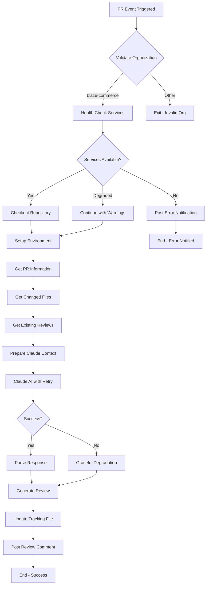
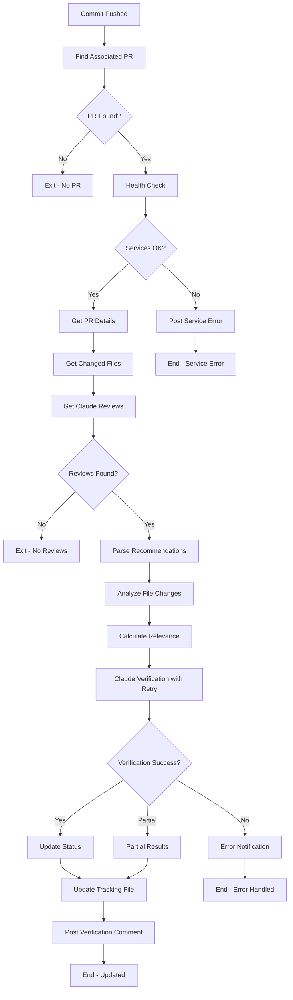
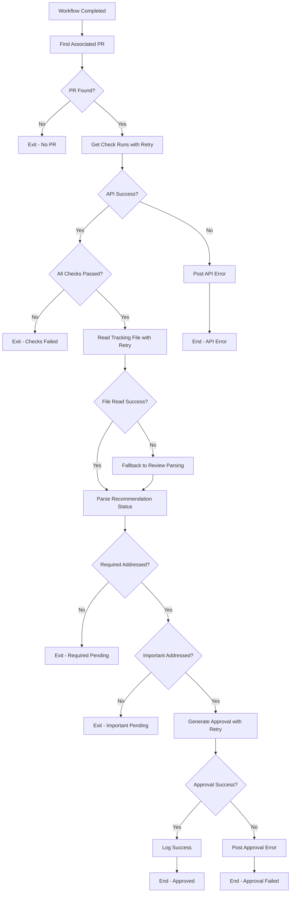

# 🏗️ BlazeCommerce Claude AI Review Bot - System Overview

## 🎯 Mission Statement

The BlazeCommerce Claude AI Review Bot is a comprehensive, intelligent code review system that provides automated analysis, tracking, and verification of pull requests across all BlazeCommerce repositories with robust error handling and guaranteed response times.

## 🧩 Core Components

### 1. 🤖 Claude AI Integration Engine
**Purpose**: Intelligent code analysis and recommendation generation

**Key Features**:
- **Contextual Analysis**: Repository-type aware recommendations
- **Technology-Specific Guidance**: Tailored advice for Next.js, WordPress, and child themes
- **BlazeCommerce Standards**: Organization-specific best practices integration
- **Security Focus**: Automated security vulnerability detection
- **Performance Analysis**: Code efficiency and optimization recommendations

**Implementation**: 
- Uses Anthropic Claude AI API with retry mechanisms
- Custom prompts for each repository type
- Intelligent file filtering and relevance scoring

### 2. 🔍 Verification Engine
**Purpose**: Continuous tracking and validation of recommendation implementation

**Key Features**:
- **Smart File Matching**: Direct path and content-based relevance scoring
- **Implementation Detection**: Intelligent validation of recommendation addressing
- **Progress Tracking**: Real-time status updates in tracking files
- **Confidence Scoring**: Accuracy metrics for verification results

**Implementation**:
- Advanced file change analysis
- Content-based recommendation matching
- Automated status updates

### 3. 📊 Tracking System
**Purpose**: Comprehensive audit trail and progress monitoring

**Key Features**:
- **Live Updates**: Real-time tracking in `.github/CLAUDE_REVIEW_TRACKING.md`
- **Historical Record**: Complete review history with timestamps
- **Status Management**: Categorized recommendation status tracking
- **Verification Commands**: Automated validation scripts

**Implementation**:
- Markdown-based tracking files
- JSON state management
- Automated file updates

### 4. ⚡ Automated Quality Gates
**Purpose**: Intelligent auto-approval and workflow integration

**Key Features**:
- **Smart Auto-Approval**: Only when all REQUIRED and IMPORTANT recommendations addressed
- **Workflow Integration**: Validates all GitHub Actions pass successfully
- **Quality Assurance**: Multi-criteria validation before approval

**Implementation**:
- GitHub API integration
- Check run validation
- Conditional approval logic

### 5. 🛡️ Error Handling & Resilience
**Purpose**: Robust error handling with graceful degradation

**Key Features**:
- **Retry Mechanisms**: Up to 3 attempts with exponential backoff
- **Timeout Management**: Hard timeouts with user notifications
- **Circuit Breaker**: Temporary suspension after repeated failures
- **Graceful Degradation**: Partial functionality when services unavailable

**Implementation**:
- Comprehensive error detection
- User-friendly error notifications
- Service health monitoring

## 🔄 System Workflow

### Phase 1: Initial Review Process


### Phase 2: Continuous Verification


### Phase 3: Auto-Approval Process


## 🎨 Repository-Specific Customizations

### blazecommerce-frontend (Next.js/React)
**Technology Stack**: Next.js, React, TypeScript, Tailwind CSS
**Focus Areas**:
- React component patterns and hooks usage
- TypeScript type safety and interface design
- Performance optimization (Core Web Vitals)
- SEO best practices and meta tag management
- E-commerce UX patterns and accessibility

**Monitoring Scope**:
- Components (`src/components/`)
- Pages (`src/pages/` or `app/`)
- API routes (`src/pages/api/` or `app/api/`)
- Styles (`src/styles/`, CSS modules)
- Configuration files

### blazecommerce-wp-plugin (WordPress Plugin)
**Technology Stack**: PHP, WordPress APIs, WooCommerce
**Focus Areas**:
- WordPress coding standards and security
- WooCommerce integration patterns
- Database operations and optimization
- Plugin architecture and hooks
- REST API endpoint security

**Monitoring Scope**:
- PHP files (`app/`, `lib/`)
- Database operations and queries
- API endpoints and security
- WordPress hooks and filters
- Configuration and settings

### blazecommerce-child (WordPress Child Theme)
**Technology Stack**: PHP, CSS, JavaScript, WordPress themes
**Focus Areas**:
- WordPress theme hierarchy compliance
- Responsive design and mobile optimization
- Cross-browser compatibility
- Accessibility (WCAG guidelines)
- Performance optimization

**Monitoring Scope**:
- CSS files and responsive design
- PHP template files
- JavaScript functionality
- Theme configuration
- Asset optimization

## 📊 Performance Characteristics

### Response Time Guarantees
- **Expected**: < 2 minutes (95% of operations)
- **Maximum**: 15 minutes initial review, 10 minutes verification, 5 minutes auto-approval
- **Retry Logic**: Up to 3 attempts with exponential backoff (1s → 2s → 4s)

### Success Metrics
- **Success Rate**: > 95% of operations complete successfully
- **Error Recovery**: < 15 minutes for automatic recovery
- **Availability**: 99.5% uptime (excluding planned maintenance)

### API Usage Optimization
- **Claude AI**: ~2-5 calls per PR lifecycle with intelligent retry logic
- **GitHub API**: Optimized batch operations with rate limit handling
- **Cost Management**: Circuit breaker prevents excessive API usage during outages

## 🔐 Security & Configuration

### Required Secrets (per repository)
```yaml
ANTHROPIC_API_KEY: Claude AI API access key
BOT_GITHUB_TOKEN: Bot account personal access token with fine-grained permissions
```

### Bot Account Configuration
- **Username**: `blazecommerce-claude-ai`
- **Display Name**: `🤖 BlazeCommerce Claude AI Reviewer`
- **Permissions**: Repository write access, pull request management, issue management

### Security Features
- **Input Validation**: Comprehensive validation of all user inputs
- **API Key Protection**: Secure secret management in GitHub
- **Rate Limiting**: Intelligent API usage with circuit breaker protection
- **Access Control**: Fine-grained permissions for bot operations

## 🎯 Success Criteria

### Functional Requirements
- ✅ Bot responds to PR creation within 3 minutes (15 min max)
- ✅ Provides categorized, actionable recommendations
- ✅ Tracks implementation progress across commits with verification
- ✅ Auto-approves when all criteria met with proper validation
- ✅ Handles errors gracefully with user notifications and fallbacks

### Quality Requirements
- ✅ Repository-specific context awareness and customization
- ✅ BlazeCommerce standards integration across all tech stacks
- ✅ High accuracy in verification with confidence scoring
- ✅ Clear, professional communication with comprehensive error messages
- ✅ Comprehensive audit trail and performance monitoring

### Performance Requirements
- ✅ 95% of operations complete within expected timeframes
- ✅ Error rate < 5% with automatic recovery mechanisms
- ✅ Service availability > 99.5% with proper monitoring
- ✅ Cost-effective API usage with circuit breaker protection

## 🚀 Benefits & Impact

### For Developers
- **Immediate Feedback**: Review comments within 2-3 minutes average
- **Clear Guidance**: Specific, actionable recommendations with examples
- **Progress Tracking**: Visual status indicators and detailed explanations
- **Reduced Friction**: Automatic approval when standards met
- **Error Transparency**: Clear notifications when issues occur

### For Team Leads
- **Consistent Standards**: Uniform code quality across all repositories
- **Reduced Review Load**: Automated handling of routine quality checks
- **Quality Metrics**: Comprehensive tracking and reporting capabilities
- **Risk Mitigation**: Automated security and performance validation
- **Reliability**: Robust error handling ensures consistent operation

### For Organization
- **Scalable Quality**: Maintains standards as team and codebase grows
- **Knowledge Transfer**: Embedded best practices in automation
- **Compliance**: Consistent application of coding standards
- **Efficiency**: Faster development cycles with maintained quality
- **Cost Control**: Optimized API usage with intelligent retry logic

This comprehensive system provides a complete, production-ready intelligent code review solution that significantly enhances code quality and development efficiency across all BlazeCommerce repositories while ensuring reliable operation and clear user communication.
