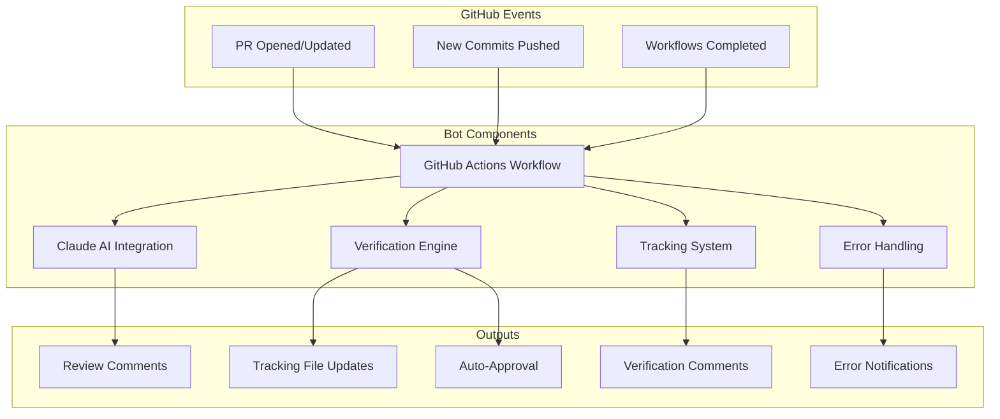

# 🤖 BlazeCommerce Claude AI Review Bot Documentation

Welcome to the comprehensive documentation for the BlazeCommerce Claude AI Review Bot - an intelligent, automated code review system that enhances development workflow across all BlazeCommerce repositories.

## 📚 Documentation Index

### Core Documentation
- **[📋 System Overview](OVERVIEW.md)** - Architecture, components, and key features
- **[🔄 Complete Workflow](WORKFLOW.md)** - Detailed process flow with visual diagrams
- **[🔍 Verification Process](VERIFICATION.md)** - Advanced tracking and validation system
- **[⚙️ Setup Guide](SETUP.md)** - Installation and configuration instructions
- **[🛠️ Troubleshooting](TROUBLESHOOTING.md)** - Common issues and solutions
- **[⏱️ Response Times & SLA](RESPONSE_TIMES_AND_SLA.md)** - Performance guarantees and metrics

## 🚀 Quick Start

### For Developers
1. **Create a PR** - The bot automatically reviews within 2-3 minutes
2. **Review Feedback** - Get categorized recommendations (🔴 REQUIRED, 🟡 IMPORTANT, 🔵 SUGGESTION)
3. **Implement Changes** - Address feedback and commit updates
4. **Auto-Approval** - Bot automatically approves when criteria are met

### For Repository Maintainers
1. **Review [Setup Guide](SETUP.md)** for initial configuration
2. **Configure repository-specific settings** in `repository-configs/`
3. **Monitor performance** via tracking files and workflow logs
4. **Customize prompts** for your technology stack

## 🎯 Key Features

### ✨ Intelligent Analysis
- **Repository-aware**: Tailored feedback for Next.js, WordPress, and child themes
- **Technology-specific**: Security, performance, and accessibility focus
- **BlazeCommerce standards**: Organization-specific best practices

### 🔄 Continuous Verification
- **Real-time tracking**: Updates on every commit
- **Smart matching**: Direct path and content-based relevance
- **Guaranteed response**: < 2 minutes average, 10 minutes maximum

### ⚡ Automated Quality Gates
- **Smart auto-approval**: Only when all critical issues addressed
- **Workflow integration**: Validates GitHub Actions success
- **Error handling**: Comprehensive retry mechanisms and notifications

## 🏗️ System Architecture



## 📊 Performance Metrics

### Response Time Guarantees
- **P95 Target**: < 5 minutes for initial review
- **Success Rate**: > 95% of operations complete successfully
- **Error Recovery**: < 15 minutes for automatic recovery
- **Availability**: 99.5% uptime (excluding planned maintenance)

### Quality Metrics
- **Accuracy**: High precision in recommendation relevance
- **Coverage**: Comprehensive analysis across all file types
- **Consistency**: Uniform standards across repositories

## 🔧 Repository-Specific Customizations

### blazecommerce-frontend (Next.js/React)
- **Focus**: React patterns, TypeScript, performance, SEO
- **Standards**: Frontend performance, accessibility, responsive design

### blazecommerce-wp-plugin (WordPress Plugin)
- **Focus**: Security, WooCommerce integration, WordPress standards
- **Standards**: Security hardening, database optimization

### blazecommerce-child (WordPress Child Theme)
- **Focus**: Design consistency, accessibility, responsive design
- **Standards**: Theme hierarchy, cross-browser compatibility

## 🛡️ Security & Configuration

### Required Secrets
```yaml
ANTHROPIC_API_KEY: Claude AI API access key
BOT_GITHUB_TOKEN: Bot account personal access token
```

### Bot Account
- **Username**: `blazecommerce-claude-ai`
- **Display Name**: `🤖 BlazeCommerce Claude AI Reviewer`
- **Permissions**: Write access with fine-grained token permissions

## 📈 Benefits

### For Developers
- **Immediate Feedback**: Review comments within 2-3 minutes
- **Clear Guidance**: Specific, actionable recommendations
- **Progress Tracking**: Visual status indicators
- **Reduced Friction**: Automatic approval when standards met

### For Team Leads
- **Consistent Standards**: Uniform code quality across repositories
- **Reduced Review Load**: Automated routine quality checks
- **Quality Metrics**: Comprehensive tracking and reporting
- **Risk Mitigation**: Automated security and performance validation

### For Organization
- **Scalable Quality**: Maintains standards as team grows
- **Knowledge Transfer**: Embedded best practices in automation
- **Compliance**: Consistent application of coding standards
- **Efficiency**: Faster development cycles with maintained quality

## 🆘 Support

### Getting Help
1. **Check [Troubleshooting Guide](TROUBLESHOOTING.md)** for common issues
2. **Review workflow logs** in GitHub Actions for detailed error information
3. **Consult [Setup Guide](SETUP.md)** for configuration questions
4. **Check service status** at [Anthropic Status](https://status.anthropic.com/)

### Contributing
- **Report Issues**: Use GitHub Issues for bug reports and feature requests
- **Suggest Improvements**: Submit PRs for documentation updates
- **Share Feedback**: Help improve the system with usage insights

---

**Ready to get started?** Begin with the [Setup Guide](SETUP.md) or dive into the [System Overview](OVERVIEW.md) for a deeper understanding of the architecture.
