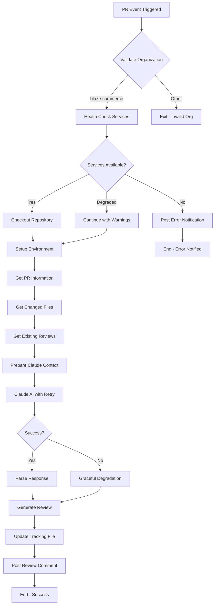
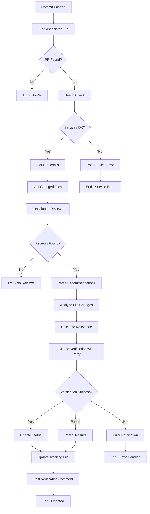
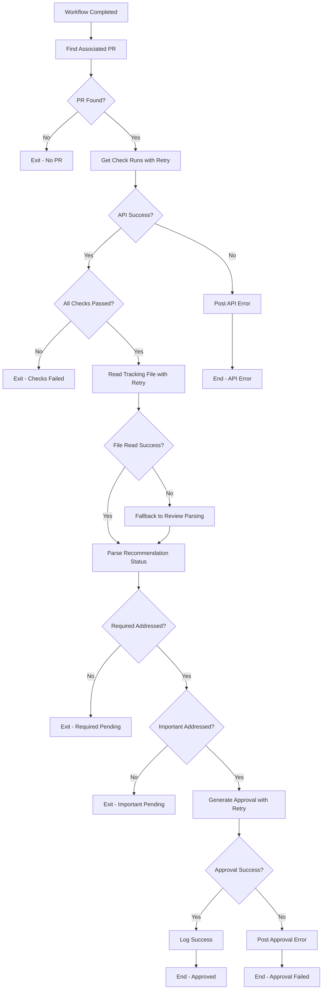

# 🔄 BlazeCommerce Claude AI Review Bot - Complete Workflow

This document provides a detailed overview of the complete workflow with visual diagrams and step-by-step processes.

## 🎯 Workflow Overview

The BlazeCommerce Claude AI Review Bot operates through three main phases:

1. **Initial Review Process** - Triggered when PRs are opened or updated
2. **Continuous Verification** - Monitors implementation of recommendations
3. **Auto-Approval Process** - Automatically approves when criteria are met

## 📊 Phase 1: Initial Review Process

### Trigger Events
- Pull request opened
- Pull request synchronized (new commits)
- Pull request reopened

### Workflow Steps



### Detailed Step Breakdown

#### 1. Organization Validation
```yaml
Purpose: Ensure bot only operates on BlazeCommerce repositories
Validation: github.repository_owner == "blaze-commerce"
Failure Action: Exit workflow immediately
```

#### 2. Service Health Check
```yaml
GitHub API: Check rate limits and connectivity
Anthropic API: Verify service availability
Circuit Breakers: Check if any services are temporarily disabled
Degraded Mode: Continue with limited functionality if needed
```

#### 3. Repository Setup
```yaml
Checkout: Full repository with history (fetch-depth: 0)
Environment: Install Node.js dependencies (axios, @octokit/rest)
Scripts: Ensure verification and tracking scripts are available
```

#### 4. PR Information Gathering
```yaml
PR Details: Title, body, author, base/head branches
Changed Files: List of modified files with patches
File Analysis: Count, types, and change patterns
Existing Reviews: Previous Claude AI comments
```

#### 5. Repository-Specific Context
```yaml
Frontend (Next.js): React, TypeScript, performance focus
WordPress Plugin: Security, WooCommerce, database optimization
Child Theme: Design, accessibility, responsive patterns
```

#### 6. Claude AI Analysis
```yaml
Model: claude-3-5-sonnet-20241022
Max Tokens: 4000
Timeout: 60 seconds per attempt
Retry Logic: 3 attempts with exponential backoff
```

#### 7. Response Processing
```yaml
Categorization: REQUIRED (🔴), IMPORTANT (🟡), SUGGESTION (🔵)
Formatting: Markdown with clear action items
Tracking: Initialize recommendation tracking system
```

### Performance Targets
- **Expected Time**: 2-3 minutes
- **Maximum Time**: 15 minutes (hard timeout)
- **Success Rate**: > 95%
- **Retry Attempts**: Up to 3 with exponential backoff

## 📊 Phase 2: Continuous Verification

### Trigger Events
- New commits pushed to PR branch
- Files modified in the PR

### Workflow Steps



### Verification Engine Process

#### 1. Recommendation Parsing
```yaml
Extract: Parse REQUIRED, IMPORTANT, SUGGESTION items
Categorize: Organize by priority and type
Track: Maintain unique IDs for each recommendation
```

#### 2. File Change Analysis
```yaml
Relevance Scoring: Calculate file-to-recommendation relevance
Content Matching: Analyze code changes for implementation evidence
Confidence Calculation: Determine implementation confidence (0-100%)
```

#### 3. Status Updates
```yaml
Addressed: Confidence >= 70%
Partial: Confidence 40-69%
Pending: Confidence < 40%
Verified: Manual or high-confidence confirmation
```

#### 4. Tracking File Updates
```yaml
Markdown Format: Human-readable progress tracking
JSON State: Machine-readable state management
History: Complete audit trail of changes
```

### Performance Targets
- **Expected Time**: 1-2 minutes
- **Maximum Time**: 10 minutes (hard timeout)
- **Accuracy**: > 70% confidence threshold
- **Update Frequency**: On every commit

## 📊 Phase 3: Auto-Approval Process

### Trigger Events
- GitHub Actions workflow completion
- All checks passing status

### Workflow Steps



### Auto-Approval Criteria

**IMPORTANT**: Auto-approval now requires **ALL** conditions to be met (AND logic, not OR).

#### 1. Technical Requirements
```yaml
GitHub Actions: All workflows must pass
Check Runs: No failed checks
Build Status: Successful compilation/build
Test Results: All tests passing
```

#### 2. Claude Review Requirements (MANDATORY)
```yaml
Claude Review Status: Must complete successfully
Claude Authentication: Must use official Anthropic action
Review Comments: Must be posted successfully
```

#### 3. Recommendation Requirements (MANDATORY)
```yaml
REQUIRED Items: ALL must be addressed (no exceptions)
IMPORTANT Items: ALL must be addressed (no exceptions)
SUGGESTION Items: Optional (not required for approval)
Parsing Method: Direct comment parsing OR tracking file
```

#### 4. Approval Revocation Protection (NEW)
```yaml
Previous Approval Status: No recent revocation due to new critical issues
New Commit Analysis: Latest commits must not introduce REQUIRED/IMPORTANT issues
Revocation Check: System automatically revokes approval if new critical issues found
Security Gate: Prevents merge of previously-approved code with new vulnerabilities
```

#### 4. Quality Gates
```yaml
Code Coverage: Maintained or improved (if configured)
Security Scans: No new vulnerabilities
Performance: No significant regressions
Documentation: Updated as needed
```

#### 5. Logic Changes (Fixed Bugs)
```yaml
Previous Logic: Claude Success OR Tracking Complete OR Recommendations Addressed
Current Logic: Claude Success AND All REQUIRED Addressed AND All IMPORTANT Addressed
Tracking File: Optional (will parse Claude comments if missing)
Bypass Logic: Removed (no more auto-approval without recommendation checking)
```

#### 6. Approval Revocation System (NEW SECURITY FEATURE)
```yaml
Revocation Trigger: New commits introducing REQUIRED or IMPORTANT recommendations
Revocation Action: Automatic REQUEST_CHANGES review creation
Revocation Prevention: Blocks auto-approval until new issues are resolved
Security Benefit: Prevents merge of previously-approved code with new vulnerabilities
Audit Trail: Comprehensive logging of all revocation decisions
```

### Performance Targets
- **Expected Time**: < 1 minute
- **Maximum Time**: 5 minutes (hard timeout)
- **Accuracy**: 100% (only approve when criteria truly met)
- **False Positives**: < 1%

## 🔄 Error Handling and Recovery

### Error Types and Responses

#### 1. Service Unavailable
```yaml
Anthropic API: Retry with exponential backoff
GitHub API: Rate limit handling and retry
Network Issues: Temporary retry with jitter
Circuit Breaker: Prevent excessive API calls
```

#### 2. Timeout Handling
```yaml
Initial Review: 15-minute hard timeout
Verification: 10-minute hard timeout
Auto-Approval: 5-minute hard timeout
User Notification: Clear timeout messages
```

#### 3. Graceful Degradation
```yaml
Partial Service: Continue with available functionality
Fallback Methods: Alternative verification approaches
User Communication: Clear status updates
Recovery: Automatic retry on next commit
```

## 📊 Monitoring and Metrics

### Performance Metrics
```yaml
Response Times: P50, P95, P99 percentiles
Success Rates: By operation type
Error Rates: Categorized by error type
API Usage: Cost and rate limit monitoring
```

### Quality Metrics
```yaml
Recommendation Relevance: User feedback scores
Verification Accuracy: Manual validation sampling
False Positive Rate: Incorrect auto-approvals
User Satisfaction: Survey and feedback data
```

### Operational Metrics
```yaml
Uptime: Service availability percentage
Recovery Time: Error resolution duration
Circuit Breaker: Activation frequency
Resource Usage: Memory and CPU utilization
```

## 🎯 Workflow Optimization

### Performance Optimizations
- **Parallel Processing**: Multiple API calls where possible
- **Caching**: Reduce redundant API calls
- **Batch Operations**: Group related operations
- **Smart Filtering**: Focus on relevant files only

### Quality Improvements
- **Context Enhancement**: Better repository-specific prompts
- **Learning Integration**: Improve based on feedback
- **Verification Refinement**: Enhanced confidence scoring
- **User Experience**: Clearer communication and guidance

### Reliability Enhancements
- **Redundancy**: Multiple verification methods
- **Monitoring**: Comprehensive health checks
- **Alerting**: Proactive issue detection
- **Documentation**: Clear troubleshooting guides

## 🚀 Future Enhancements

### Planned Features
- **Machine Learning**: Improve recommendation accuracy
- **Integration**: Connect with additional tools
- **Customization**: More granular configuration options
- **Analytics**: Advanced reporting and insights

### Scalability Improvements
- **Multi-Repository**: Cross-repository learning
- **Team Integration**: Role-based customization
- **Workflow Integration**: Deeper CI/CD integration
- **Performance**: Further optimization for large repositories

This comprehensive workflow ensures reliable, efficient, and high-quality automated code review across all BlazeCommerce repositories while maintaining excellent user experience and system reliability.
