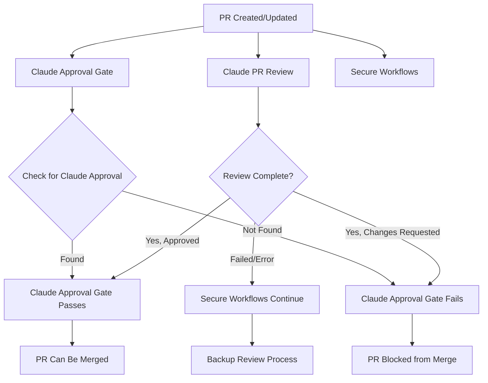

# Claude AI Workflow Sequence Documentation

## Overview

This document explains the correct sequence and dependencies of Claude AI workflows in the BlazeCommerce WordPress Plugin repository, including how they interact and the fixes applied to resolve trigger issues.

## Workflow Sequence & Dependencies

### 1. **Primary Claude PR Review Workflow** (`claude-pr-review.yml`)

**Purpose**: Main Claude AI code review workflow that provides detailed analysis and feedback.

**Triggers**:
- `pull_request: [opened, synchronize, reopened]`
- `pull_request_review: [submitted, dismissed]`

**Key Features**:
- ✅ **Smart Skip Logic**: Only skips for minor workflow maintenance on already-approved PRs
- ✅ **Comprehensive Review**: Provides detailed code analysis and suggestions
- ✅ **Approval Authority**: Can approve PRs that meet quality standards

**Dependencies**: None (runs independently)

### 2. **Claude Approval Gate Workflow** (`claude-approval-gate.yml`)

**Purpose**: Creates a required status check that only passes when Claude AI has approved the PR.

**Triggers**:
- `pull_request: [opened, synchronize, reopened]`
- `pull_request_review: [submitted, dismissed]`

**Key Features**:
- ✅ **Required Status Check**: Used with GitHub Branch Protection Rules
- ✅ **Approval Verification**: Checks for Claude AI approval before allowing merge
- ✅ **Status Updates**: Sets commit status based on approval state

**Dependencies**: **WAITS FOR** Claude PR Review workflow to complete and approve

### 3. **Secure Workflows** (`claude-pr-review-secure.yml`, `claude-pr-review-simple.yml`)

**Purpose**: Backup/alternative Claude AI review workflows with different security models.

**Triggers**: Same as primary workflow

**Key Features**:
- ✅ **Fallback Options**: Provide redundancy if primary workflow fails
- ✅ **Different Permissions**: Use different token/permission models
- ✅ **Simplified Logic**: Less complex skip logic for reliability

**Dependencies**: Run independently alongside primary workflow

## Workflow Interaction Flow



## Recent Fixes Applied (2025-07-13)

### **Issue Identified**: Overly Broad Skip Logic

**Problem**: The main Claude PR review workflow was incorrectly skipping legitimate workflow improvement PRs due to overly broad skip conditions.

**Root Cause**: 
```javascript
// ❌ PROBLEMATIC LOGIC (Before Fix)
const isWorkflowFix = commitMessage.includes('workflow') ||
                    commitMessage.includes('fix:') ||  // TOO BROAD!
                    commitMessage.includes('claude') ||
                    files.some(file => file.filename.startsWith('.github/workflows/'));
```

This logic would skip ANY commit with `fix:` in the message, even major workflow improvements that needed review.

### **Fix Applied**: Specific Skip Conditions

**Solution**: Made skip logic much more specific and only apply to minor maintenance:

```javascript
// ✅ IMPROVED LOGIC (After Fix)
const isMinorWorkflowFix = (
  // Only skip for specific minor workflow maintenance patterns
  (commitMessage.includes('chore:') && commitMessage.includes('workflow')) ||
  (commitMessage.includes('docs:') && commitMessage.includes('workflow')) ||
  (commitMessage.includes('fix:') && commitMessage.includes('claude') && commitMessage.includes('workflow')) ||
  // Or if it's specifically a Claude bot fix
  (commitMessage.includes('claude') && commitMessage.includes('bot')) ||
  // And only if files are limited to specific workflow maintenance (not major changes)
  (files.length <= 3 && files.every(file => 
    (file.filename.startsWith('.github/workflows/') && 
     !file.filename.includes('claude-pr-review') &&
     !file.filename.includes('auto-version') &&
     !file.filename.includes('release')) ||
    file.filename.startsWith('docs/') ||
    file.filename === 'README.md'
  ))
);
```

### **Key Improvements**:

1. **✅ Specific Patterns Only**: Only skips for `chore:` or `docs:` workflow changes
2. **✅ File Restrictions**: Must be ≤3 files and exclude major workflow files
3. **✅ Major Workflow Protection**: Never skips changes to `claude-pr-review`, `auto-version`, or `release` workflows
4. **✅ Better Logging**: Added detailed logging for debugging skip decisions
5. **✅ Early Return for Unapproved PRs**: Immediately proceeds with review if PR not approved

## Expected Workflow Behavior

### **For New PRs** (like PR #332):
1. **Claude PR Review**: ✅ **RUNS** - Provides comprehensive review
2. **Claude Approval Gate**: ✅ **RUNS** - Waits for Claude approval
3. **Secure Workflows**: ✅ **RUN** - Provide backup reviews

### **For Approved PRs with Minor Changes**:
1. **Claude PR Review**: ⏭️ **SKIPS** - Only for minor maintenance
2. **Claude Approval Gate**: ✅ **RUNS** - Checks existing approval
3. **Secure Workflows**: ✅ **RUN** - Continue as backup

### **For Approved PRs with Major Changes**:
1. **Claude PR Review**: ✅ **RUNS** - Reviews major changes
2. **Claude Approval Gate**: ✅ **RUNS** - Requires new approval
3. **Secure Workflows**: ✅ **RUN** - Provide additional review

## Testing the Fixes

### **Test Cases for Skip Logic**:

#### **Should SKIP (Minor Maintenance)**:
```bash
# Minor workflow documentation
git commit -m "docs: update workflow documentation"

# Minor workflow chores
git commit -m "chore: fix workflow formatting"

# Claude bot fixes
git commit -m "fix: claude bot permission issue"
```

#### **Should NOT SKIP (Major Changes)**:
```bash
# Major workflow improvements (like PR #332)
git commit -m "fix: repair auto-version and release workflows"

# New features
git commit -m "feat: add new Claude AI review capabilities"

# Any non-workflow fixes
git commit -m "fix: resolve product pricing calculation bug"
```

## Monitoring & Troubleshooting

### **Check Workflow Status**:
1. Go to GitHub Actions tab
2. Look for these workflows on PRs:
   - "Claude AI PR Review" (main)
   - "Claude AI Approval Gate" (status check)
   - "Claude AI PR Review (Secure)" (backup)

### **Debug Skip Logic**:
The workflow now logs detailed information:
```
✅ Major workflow changes detected - proceeding with review
📝 Commit message: fix: repair auto-version and release workflows
📁 Files changed: .github/workflows/auto-version.yml, .github/workflows/release.yml, docs/development/automation.md
```

### **Common Issues**:

1. **Workflow Not Triggering**: Check branch patterns and trigger conditions
2. **Unexpected Skipping**: Review commit message and file patterns against skip logic
3. **Approval Gate Failing**: Ensure Claude AI has actually approved the PR

## Branch Protection Integration

The Claude Approval Gate workflow is designed to work with GitHub Branch Protection Rules:

1. **Add Required Status Check**: `claude-ai/approval-required`
2. **Block Merging**: Until Claude AI approval is found
3. **Allow Bypass**: For repository administrators if needed

---

**Document Version**: 1.0  
**Created**: 2025-07-13  
**Author**: BlazeCommerce Development Team  
**Related**: claude-pr-review.yml, claude-approval-gate.yml
