# GitHub Workflow Priority Structure Documentation

## Overview

This document explains the restructured priority system for GitHub workflows in the BlazeCommerce WordPress Plugin repository, ensuring proper execution order and dependencies between workflows.

## Workflow Priority Structure (Updated 2025-07-14)

### **🔍 Priority 1: Workflow Pre-flight Check** (`workflow-preflight-check.yml`)

**Purpose**: Test workflow connectivity and initialization BEFORE Claude review to ensure proper workflow sequencing.

**Triggers**:
- `pull_request: [opened, synchronize, reopened]`
- `pull_request_review: [submitted, dismissed]`

**Key Features**:
- ✅ **Highest Priority**: Must run BEFORE all other workflows
- ✅ **Approval Initialization**: Sets up approval process for subsequent workflows
- ✅ **Direct Approval Logic**: Handles immediate approval scenarios

**Dependencies**: None (runs first in sequence)
**Concurrency**: `priority-1-workflow-preflight-pr-{PR_NUMBER}`

### **🤖 Priority 2: Claude AI Code Review** (`claude-code-review.yml`)

**Purpose**: Reviews PR code and posts detailed analysis after approval initialization.

**Triggers**:
- `pull_request: [opened, synchronize]`
- `workflow_run: ["🔍 Priority 1: Workflow Pre-flight Check"]`

**Key Features**:
- ✅ **Comprehensive Review**: Provides detailed code analysis and suggestions
- ✅ **Standardized Verdict**: Uses FINAL VERDICT format for approval decisions
- ✅ **Dependency Aware**: Waits for Priority 1 completion

**Dependencies**: **WAITS FOR** Priority 1 (Workflow Pre-flight Check) to complete
**Concurrency**: `priority-2-claude-review-pr-{PR_NUMBER}`

### **✅ Priority 3: Claude AI Approval Gate** (`claude-approval-gate.yml`)

**Purpose**: Processes Claude's review verdict and triggers @blazecommerce-claude-ai approval.

**Triggers**:
- `pull_request: [opened, synchronize, reopened]`
- `pull_request_review: [submitted, dismissed]`
- `issue_comment: [created]`
- `workflow_run: ["🤖 Priority 2: Claude AI Code Review"]`

**Key Features**:
- ✅ **Required Status Check**: Used with GitHub Branch Protection Rules
- ✅ **Approval Processing**: Converts Claude review to @blazecommerce-claude-ai approval
- ✅ **Status Updates**: Sets commit status based on approval state

**Dependencies**: **WAITS FOR** Priority 2 (Claude AI Code Review) to complete
**Concurrency**: `priority-3-claude-approval-pr-{PR_NUMBER}`

### **🔢 Priority 4: Auto Version Bump** (`auto-version.yml`)

**Purpose**: Bumps version numbers ONLY after PR approval and Priority 3 completion.

**Triggers**:
- `push: [main, develop, feature/**, release/**]`

**Key Features**:
- ✅ **Post-Approval Only**: Requires explicit PR approval before execution
- ✅ **Version Conflict Prevention**: Pulls latest changes before version operations
- ✅ **Dependency Enforcement**: Waits for Priority 3 completion

**Dependencies**: **WAITS FOR** Priority 3 (Claude AI Approval Gate) + **REQUIRES** PR approval
**Concurrency**: `priority-4-auto-version-{REPOSITORY}`

### **🚀 Priority 5: Create Release** (`release.yml`)

**Purpose**: Creates official release with assets after version management completes.

**Triggers**:
- `push: [tags: 'v*']`

**Key Features**:
- ✅ **Lowest Priority**: Runs after all other workflows complete
- ✅ **Version Conflict Prevention**: Pulls latest changes before release operations
- ✅ **Asset Creation**: Builds and packages release artifacts

**Dependencies**: **WAITS FOR** Priority 4 (Auto Version Bump) to complete successfully
**Concurrency**: `priority-5-release-{REPOSITORY}`

## Workflow Execution Flow

```mermaid
graph TD
    A[PR Created/Updated] --> B[🔍 Priority 1: Workflow Pre-flight Check]
    B --> C[🤖 Priority 2: Claude AI Code Review]
    C --> D[✅ Priority 3: Claude AI Approval Gate]

    D --> E{PR Approved?}
    E -->|Yes| F[PR Merged to Main]
    E -->|No| G[PR Blocked from Merge]

    F --> H[🔢 Priority 4: Auto Version Bump]
    H --> I{Version Bump Needed?}
    I -->|Yes| J[Create Git Tag]
    I -->|No| K[Skip Version Bump]

    J --> L[🚀 Priority 5: Create Release]
    L --> M[Build Assets & Create GitHub Release]

    K --> N[Workflow Complete]
    M --> N
    G --> O[Address Review Feedback]
    O --> A
```



## Priority Restructuring Implementation (2025-07-14)

### **Issue Identified**: Workflow Execution Order Problems

**Problem**: Direct approval workflow was running AFTER Claude review instead of BEFORE, causing approval process initialization issues.

**Root Cause**:
- Inconsistent priority naming across workflows
- Missing explicit dependencies between workflows
- Race conditions between version management workflows

### **Solution Applied**: Comprehensive Priority Restructuring

**Key Changes**:

1. **✅ Standardized Naming**: All workflows now use consistent priority indicators
2. **✅ Explicit Dependencies**: Each workflow waits for previous priority completion
3. **✅ Concurrency Management**: Proper concurrency groups prevent race conditions
4. **✅ Approval Enforcement**: Auto-version only runs after explicit PR approval
5. **✅ Version Conflict Prevention**: Both auto-version and release pull latest changes

## Workflow Dependency Fixes (2025-07-14)

### **Critical Issue Identified in PR #352**: Dual Trigger System

**Problem**: Priority 2 (Claude AI Code Review) had dual triggers that bypassed Priority 1 dependency:

```yaml
# PROBLEMATIC: Dual trigger system
on:
  pull_request:                    # ← IMMEDIATE TRIGGER (bypassed dependency)
    types: [opened, synchronize]
  workflow_run:                    # ← DEPENDENCY TRIGGER (intended)
    workflows: ["🔍 Priority 1: Workflow Pre-flight Check"]
    types: [completed]
```

**Root Cause**: When PR was created, `pull_request` trigger fired immediately, allowing Priority 2 to run before Priority 1.

### **Solution Applied**: Strict Dependency Enforcement

**Fixed Configuration**:
```yaml
# FIXED: Single dependency trigger only
on:
  workflow_run:                    # ← ONLY DEPENDENCY TRIGGER
    workflows: ["🔍 Priority 1: Workflow Pre-flight Check"]
    types: [completed]
  pull_request_review:             # ← ADDED FOR REVIEW UPDATES
    types: [submitted, dismissed]
```

**Key Improvements**:

1. **✅ Removed Dual Triggers**: Eliminated `pull_request` trigger that bypassed dependencies
2. **✅ Enhanced Validation**: Added strict Priority 1 completion validation
3. **✅ Explicit Outputs**: Priority 1 now provides success/failure status for downstream workflows
4. **✅ Comprehensive Logging**: Detailed workflow sequence logging for debugging
5. **✅ Sequence Validation**: Each workflow validates previous priority completion

### **Critical Implementation Requirements**:

1. **Workflow Dependencies**:
   ```yaml
   # Priority 2 waits for Priority 1
   wait-for-priority-1:
     runs-on: ubuntu-latest
     steps:
       - name: Check Priority 1 Completion
         uses: actions/github-script@v7
         # Verifies Priority 1 workflow completed successfully
   ```

2. **Approval Checks**:
   ```yaml
   # Priority 4 requires explicit approval
   if: |
     github.ref == 'refs/heads/main' &&
     needs.wait-for-priority-3.outputs.pr-approved == 'true'
   ```

3. **Version Conflict Prevention**:
   ```yaml
   - name: Pull Latest Changes to Prevent Version Conflicts
     run: |
       git fetch origin main
       git reset --hard origin/main
   ```

## Expected Workflow Behavior

### **For New PRs**:
1. **🔍 Priority 1**: ✅ **RUNS** - Initializes approval process
2. **🤖 Priority 2**: ✅ **RUNS** - Provides comprehensive code review
3. **✅ Priority 3**: ✅ **RUNS** - Processes approval gate
4. **🔢 Priority 4**: ⏭️ **WAITS** - Only runs after PR approval and merge
5. **🚀 Priority 5**: ⏭️ **WAITS** - Only runs after version bump creates tag

### **For PR Approval Flow**:
1. **🔍 Priority 1**: ✅ **RUNS** - Checks for existing approvals
2. **🤖 Priority 2**: ✅ **RUNS** - Reviews changes and provides verdict
3. **✅ Priority 3**: ✅ **RUNS** - Converts Claude verdict to @blazecommerce-claude-ai approval
4. **Merge Enabled**: ✅ PR can now be merged (subject to other branch protection rules)

### **For Post-Merge Version Management**:
1. **🔢 Priority 4**: ✅ **RUNS** - Bumps version numbers and creates git tag
2. **🚀 Priority 5**: ✅ **RUNS** - Creates GitHub release with assets

## Testing the Priority Structure

### **Verification Steps**:

1. **Create Test PR**:
   ```bash
   git checkout -b test/workflow-priority-verification
   echo "test" > test-file.txt
   git add test-file.txt
   git commit -m "test: verify workflow priority execution order"
   git push origin test/workflow-priority-verification
   ```

2. **Monitor Workflow Execution**:
   - Check GitHub Actions tab for proper sequence
   - Verify Priority 1 runs first
   - Confirm Priority 2 waits for Priority 1 completion
   - Validate Priority 3 waits for Priority 2 completion

3. **Test Approval Flow**:
   - Wait for Claude review with APPROVED verdict
   - Verify @blazecommerce-claude-ai approval is triggered
   - Confirm PR becomes mergeable

## Monitoring & Troubleshooting

### **Check Workflow Status**:
1. Go to GitHub Actions tab
2. Look for these workflows in priority order:
   - "🔍 Priority 1: Workflow Pre-flight Check"
   - "🤖 Priority 2: Claude AI Code Review"
   - "✅ Priority 3: Claude AI Approval Gate"
   - "🔢 Priority 4: Auto Version Bump" (post-merge)
   - "🚀 Priority 5: Create Release" (on tag creation)

### **Debug Dependency Issues**:
The workflows now log detailed dependency information:
```
DEBUG: Checking Priority 3 workflow completion...
SUCCESS: ✅ Priority 3: Claude AI Approval Gate completed with status: success
INFO: PR is approved by @blazecommerce-claude-ai - proceeding with version bump
```

### **Common Issues**:

1. **Workflow Not Triggering**: Check priority dependencies and trigger conditions
2. **Dependency Timeout**: Increase timeout values in workflow variables
3. **Approval Gate Failing**: Ensure Claude AI has provided APPROVED verdict
4. **Version Conflicts**: Check that latest changes are pulled before version operations

## Branch Protection Integration

The Priority 3 (Claude Approval Gate) workflow is designed to work with GitHub Branch Protection Rules:

1. **Add Required Status Check**: `claude-ai/approval-required`
2. **Block Merging**: Until Claude AI approval is found
3. **Allow Bypass**: For repository administrators if needed

## Concurrency Management

Each priority level uses specific concurrency groups to prevent race conditions:

- **Priority 1-3**: `priority-{N}-{workflow-name}-pr-{PR_NUMBER}`
- **Priority 4-5**: `priority-{N}-{workflow-name}-{REPOSITORY}`

This ensures:
- ✅ PR workflows don't interfere with each other
- ✅ Version management workflows run sequentially
- ✅ No race conditions between concurrent PRs

---

**Document Version**: 2.0
**Created**: 2025-07-13
**Updated**: 2025-07-14 (Priority Restructuring)
**Author**: BlazeCommerce Development Team
**Related**: All workflow files in `.github/workflows/`
