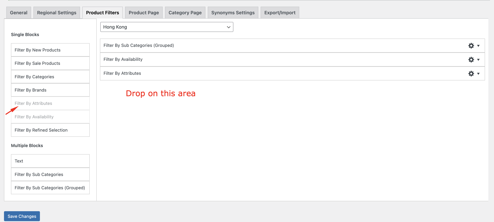

# Category Filter - Attributes Filter

> Display category filters based on attributes.

## 🌍 Overview

The Category Filter - Attributes Filter feature allows WooCommerce store owners to display category filters based on attributes. This is particularly useful for:
- Displaying category filters based on attributes
- Allowing customers to filter products based on attributes

## 🚀 Quick Start

1. Navigate to **Blaze Commerce > Settings > Product Filters**
2. Drag and drop the **"Filter by Attributes"** block from the left panel to the right side of the page.

3. Expand the **"Filter by Attributes"** block that was dropped. You should see some fields to enter the **"Title and"** **"Attribute Type's (separated by comma)"**.
3.a Title - This is the title of the filter.
3.b Attribute Type's - This is the attribute type that you want to filter by. You can enter multiple attribute types by separating them with a comma.

**IMPORTANT: You can get the attribute types on the Products > Attributes. Use the slug provided from the list.**

4. Save the settings.
5. Make sure to do a resync on the BlazeCommerce Products
6. Make sure to do a resync on the BlazeCommerce Site Info
7. Redeploy the site

And you're done! You should see the filters per attribute now on the category page. Do note that the filter will only show if there's something to filter on.

