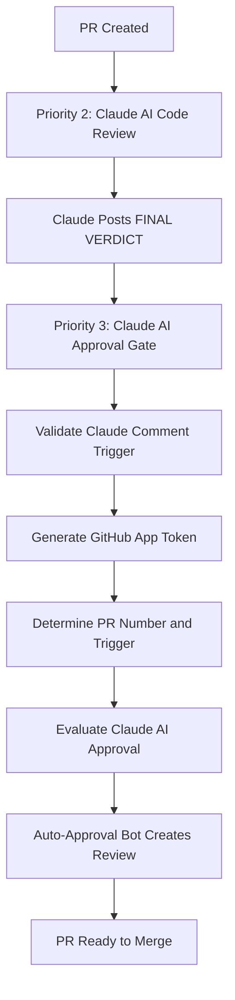

# Complete Auto-Approval System Validation

## Overview

This document validates the complete restoration of the Claude AI auto-approval system following the successful implementation of two critical fixes:

1. **PR #404**: Shell script error fix ("margin-left:: command not found")
2. **PR #406**: Automatic trigger conditional logic fix (claude-approval-gate job skipping)

## System Architecture

### Workflow Sequence


### Critical Components

#### 1. Shell Script Error Resolution (PR #404)
**Problem Solved**: HTML content with CSS styles causing shell script interpretation errors
```bash
# BEFORE (Failing):
echo "${{ github.event.comment.body }}" | head -c 300
# Error: margin-left:: command not found (exit code 127)

# AFTER (Working):
env:
  COMMENT_BODY: ${{ github.event.comment.body }}
run: |
  printf '%s\n' "${COMMENT_BODY}" | head -c 300
```

#### 2. Automatic Trigger Logic Fix (PR #406)
**Problem Solved**: Complex multi-line YAML conditional logic causing job skips
```yaml
# BEFORE (Causing Skips):
if: |
  github.event_name == 'workflow_dispatch' ||
  (github.event_name == 'issue_comment' &&
   contains(github.event.comment.body, 'FINAL VERDICT') &&
   # ... complex nested conditions)

# AFTER (Reliable):
if: github.event_name == 'issue_comment' || github.event_name == 'workflow_dispatch'
```

## Validation Test Scenarios

### Test Case 1: End-to-End Automation
**Objective**: Validate complete workflow without manual intervention

**Steps**:
1. Create test PR with meaningful changes
2. Monitor Priority 2: Claude AI Code Review automatic trigger
3. Verify Claude posts comprehensive review with FINAL VERDICT
4. Confirm Priority 3: Claude AI Approval Gate automatic trigger
5. Validate claude-approval-gate job executes (not skipped)
6. Verify auto-approval bot creates approval review
7. Confirm complete process within 5-10 minutes

**Success Criteria**:
- ✅ No shell script errors in debug steps
- ✅ No job skipping due to conditional logic failures
- ✅ Automatic triggering via issue_comment events
- ✅ Auto-approval creation within expected timeframe
- ✅ Zero manual workflow_dispatch interventions required

### Test Case 2: HTML Content Safety
**Objective**: Confirm HTML with CSS styles processes safely

**Test Content Examples**:
```html
<div style="margin-left: 10px; color: #333;">Content</div>

<span style="display: inline-block; margin-left: auto;">Text</span>
```

**Validation Points**:
- Environment variables handle HTML content safely
- No shell command interpretation of CSS properties
- printf '%s\n' safely processes special characters
- Debug conditional logic job completes successfully

### Test Case 3: Bot Detection Logic
**Objective**: Verify enhanced bot detection using environment variables

**Detection Patterns**:
```bash
if [[ "${COMMENT_USER}" == "blazecommerce-automation-bot[bot]" ]] || \
   [[ "${COMMENT_USER}" == *"blazecommerce-automation-bot"* ]] || \
   [[ "${COMMENT_USER_TYPE}" == "Bot" && "${COMMENT_USER}" == *"blazecommerce"* ]]; then
```

**Validation**:
- Exact match: blazecommerce-automation-bot[bot]
- Partial match: contains blazecommerce-automation-bot
- Type + partial: Bot type with blazecommerce in name

### Test Case 4: Conditional Logic Evaluation
**Objective**: Confirm new validation step works correctly

**Validation Checks**:
1. Event type verification (issue_comment vs workflow_dispatch)
2. Comment body contains "FINAL VERDICT"
3. Comment body contains "Claude AI PR Review Complete"
4. Comment user matches bot detection patterns
5. Graceful handling of invalid triggers

**Expected Behavior**:
- Job runs (not skipped) for all valid triggers
- Early exit with clear logging for invalid triggers
- Comprehensive debugging output for troubleshooting

## Performance Benchmarks

### Timing Requirements
- **Claude Review**: Complete within 3 minutes of PR creation
- **Approval Gate Trigger**: Within 1 minute of Claude's FINAL VERDICT comment
- **Auto-Approval Creation**: Within 2 minutes of approval gate execution
- **Total End-to-End**: Complete workflow within 5-10 minutes

### Resource Utilization
- **Workflow Execution**: Efficient resource usage with timeout controls
- **GitHub API Calls**: Optimized to prevent rate limiting
- **Token Management**: Secure GitHub App token generation and usage
- **Error Handling**: Graceful degradation with comprehensive logging

## Security Considerations

### Authentication & Authorization
- **GitHub App Authentication**: Scoped permissions for security
- **Bot Verification**: Multiple detection methods prevent unauthorized approvals
- **Commit SHA Verification**: Ensures approval matches specific commit
- **Audit Trail**: Complete logging of all approval decisions

### Input Validation & Sanitization
- **Environment Variables**: Prevent shell injection attacks
- **HTML Content Processing**: Safe handling of user-generated content
- **Comment Validation**: Strict criteria for valid Claude comments
- **Error Boundaries**: Controlled failure modes with security implications

### Access Control
- **Repository Permissions**: Proper GitHub repository access controls
- **Workflow Permissions**: Minimal required permissions for each job
- **Token Scoping**: Limited scope GitHub App tokens
- **Review Requirements**: Automated but auditable approval process

## Monitoring & Observability

### Key Metrics
- **Success Rate**: Percentage of successful auto-approvals
- **Timing Performance**: Average time from PR to approval
- **Error Frequency**: Rate of workflow failures or skips
- **Manual Intervention**: Frequency of required manual triggers

### Logging & Debugging
- **Comprehensive Logging**: Detailed output for each validation step
- **Error Classification**: Clear categorization of failure types
- **Performance Tracking**: Timing data for optimization
- **Audit Trail**: Complete record of approval decisions

### Alerting & Notifications
- **Failure Detection**: Automated detection of system issues
- **Performance Degradation**: Monitoring for timing regressions
- **Security Events**: Alerts for unauthorized approval attempts
- **System Health**: Overall auto-approval system status

## Troubleshooting Guide

### Common Issues & Solutions

#### Issue: claude-approval-gate job skipped
**Symptoms**: Job shows "conclusion: skipped" instead of "success"
**Root Cause**: Conditional logic evaluation failure
**Solution**: Verify simplified conditional logic is active
**Prevention**: Monitor job execution status in workflow runs

#### Issue: Shell script errors in debug steps
**Symptoms**: "command not found" errors with CSS properties
**Root Cause**: HTML content interpreted as shell commands
**Solution**: Confirm environment variable usage is active
**Prevention**: Test with HTML content containing CSS styles

#### Issue: Auto-approval not created
**Symptoms**: Workflow completes but no approval review appears
**Root Cause**: Validation step failing or token issues
**Solution**: Check validation step logs and GitHub App token
**Prevention**: Monitor validation step output and token generation

#### Issue: Timing performance degradation
**Symptoms**: Workflow takes longer than expected benchmarks
**Root Cause**: GitHub API rate limiting or resource constraints
**Solution**: Optimize API calls and check GitHub status
**Prevention**: Monitor timing metrics and resource usage

## Test Results Documentation

### Workflow Run IDs
- **Priority 2 Run**: [To be recorded during test execution]
- **Priority 3 Run**: [To be recorded during test execution]
- **Debug Job**: [To be recorded during test execution]
- **Approval Job**: [To be recorded during test execution]

### Execution Timeline
- **PR Creation**: [Timestamp to be recorded]
- **Claude Review Start**: [Timestamp to be recorded]
- **Claude FINAL VERDICT**: [Timestamp to be recorded]
- **Approval Gate Trigger**: [Timestamp to be recorded]
- **Auto-Approval Created**: [Timestamp to be recorded]
- **Total Duration**: [Duration to be calculated]

### Success Indicators
- [ ] Claude AI review triggered automatically
- [ ] Claude posted comprehensive review with FINAL VERDICT
- [ ] Priority 3 workflow triggered via issue_comment event
- [ ] claude-approval-gate job executed successfully (not skipped)
- [ ] Validate Claude Comment Trigger step completed successfully
- [ ] Auto-approval bot created approval review
- [ ] Complete workflow required zero manual intervention
- [ ] Total execution time within performance benchmarks

---

**Test Status**: 🧪 **VALIDATION IN PROGRESS**  
**Created**: 2025-07-15  
**Purpose**: Validate complete auto-approval system restoration  
**Expected Outcome**: Full end-to-end automation without manual intervention  
**System Status**: Ready for production use with complete automation restored
