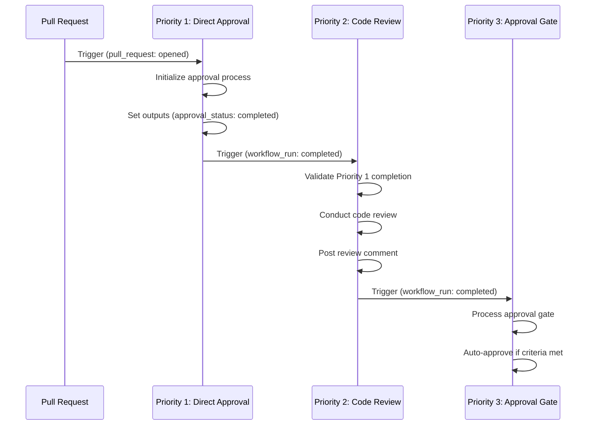

# GitHub Workflow Dependency Model

## Overview

This document explains the strict dependency model implemented to ensure proper workflow execution order in the BlazeCommerce WordPress Plugin repository.

## Problem Statement

### Issue Identified in PR #352

The workflow priority restructuring initially failed because Priority 2 (Claude AI Code Review) had a **dual trigger system** that allowed it to bypass Priority 1 (Claude Direct Approval):

```yaml
# PROBLEMATIC CONFIGURATION
on:
  pull_request:                    # ← Immediate trigger (bypassed dependency)
    types: [opened, synchronize]
  workflow_run:                    # ← Dependency trigger (intended)
    workflows: ["🔍 Priority 1: Claude Direct Approval"]
    types: [completed]
```

**Result**: When PR #352 was created, the `pull_request` trigger fired immediately at `02:36:18Z`, causing Priority 2 to run before Priority 1, defeating the entire purpose of the priority system.

## Solution: Strict Dependency Model

### 1. Single Dependency Triggers

**Fixed Configuration for Priority 2**:
```yaml
# FIXED: Single dependency trigger only
on:
  workflow_run:                    # ← ONLY dependency trigger
    workflows: ["🔍 Priority 1: Claude Direct Approval"]
    types: [completed]
  pull_request_review:             # ← Added for review updates
    types: [submitted, dismissed]
```

### 2. Enhanced Validation Logic

**Priority 2 Validation Process**:
```javascript
// ALWAYS validate Priority 1 completion regardless of trigger
const workflowRuns = await github.rest.actions.listWorkflowRunsForRepo({
  owner: context.repo.owner,
  repo: context.repo.repo,
  workflow_id: 'claude-direct-approval.yml',
  head_sha: context.sha,
  status: 'completed'
});

const priority1Run = workflowRuns.data.workflow_runs.find(run => 
  run.name === '🔍 Priority 1: Claude Direct Approval' && 
  run.conclusion === 'success'
);

if (!priority1Run) {
  console.log('❌ VALIDATION: No successful Priority 1 run found');
  shouldRun = false;
}
```

### 3. Explicit Workflow Outputs

**Priority 1 Outputs**:
```yaml
outputs:
  approval_status: ${{ steps.approval-action.outputs.approval_status }}
  pr_number: ${{ steps.get-pr.outputs.pr_number }}
  execution_time: ${{ steps.log-sequence.outputs.execution_time }}
```

**Priority 2 Validation**:
```yaml
needs: [validate-workflow-sequence]
if: needs.validate-workflow-sequence.outputs.should_run == 'true'
```

## Workflow Execution Flow

### Correct Sequence (After Fixes)



### Validation Points

1. **Priority 1 Triggers**: `pull_request`, `issue_comment`, `pull_request_review`
2. **Priority 2 Validation**: Checks Priority 1 completion before proceeding
3. **Priority 3 Validation**: Checks Priority 2 completion before proceeding

## Implementation Details

### Priority 1: Claude Direct Approval

**Triggers**:
```yaml
on:
  pull_request:
    types: [opened, synchronize, reopened]
  issue_comment:
    types: [created]
  pull_request_review:
    types: [submitted, dismissed]
```

**Key Features**:
- ✅ Comprehensive triggers ensure it runs first
- ✅ Explicit outputs for downstream workflows
- ✅ Detailed logging for sequence validation

### Priority 2: Claude AI Code Review

**Triggers**:
```yaml
on:
  workflow_run:
    workflows: ["🔍 Priority 1: Claude Direct Approval"]
    types: [completed]
  pull_request_review:
    types: [submitted, dismissed]
```

**Key Features**:
- ✅ Strict dependency on Priority 1 completion
- ✅ Enhanced validation logic
- ✅ No direct `pull_request` trigger

### Priority 3: Claude AI Approval Gate

**Triggers**:
```yaml
on:
  workflow_run:
    workflows: ["🤖 Priority 2: Claude AI Code Review"]
    types: [completed]
  pull_request_review:
    types: [submitted, dismissed]
```

**Key Features**:
- ✅ Depends on Priority 2 completion
- ✅ Processes Claude's review verdict
- ✅ Triggers auto-approval when appropriate

## Monitoring and Debugging

### Workflow Sequence Logs

**Priority 1 Logs**:
```
🔍 PRIORITY 1: CLAUDE DIRECT APPROVAL STARTING
📋 EVENT: pull_request
🔗 NEXT: Priority 2 (Claude AI Code Review) will wait for this completion
⏰ EXECUTION TIME: 2025-07-14 12:00:00 UTC
```

**Priority 2 Validation Logs**:
```
🔍 PRIORITY 2: WORKFLOW SEQUENCE VALIDATION
📋 EVENT NAME: workflow_run
✅ VALIDATION: Priority 1 completed successfully
🎯 VALIDATION RESULTS: SHOULD RUN: true
```

### Common Issues and Solutions

1. **Priority 2 Running Before Priority 1**:
   - **Cause**: Dual trigger system
   - **Solution**: Remove `pull_request` trigger from Priority 2

2. **Validation Failing**:
   - **Cause**: Priority 1 not completing successfully
   - **Solution**: Check Priority 1 logs for errors

3. **Workflow Not Triggering**:
   - **Cause**: Missing workflow_run trigger
   - **Solution**: Verify trigger configuration

## Benefits

### Immediate Benefits

- ✅ **Guaranteed Execution Order**: Priority 1 always runs before Priority 2
- ✅ **No Race Conditions**: Strict dependencies prevent timing issues
- ✅ **Clear Debugging**: Comprehensive logging for troubleshooting
- ✅ **Explicit Validation**: Each workflow validates prerequisites

### Long-term Benefits

- ✅ **Reliable CI/CD**: Predictable workflow execution
- ✅ **Maintainable System**: Clear dependency model
- ✅ **Scalable Architecture**: Easy to add new workflows with proper dependencies
- ✅ **Audit Trail**: Complete logging for compliance

## Priority 1 Workflow Configuration Fixes (2025-07-14)

### **Critical Issues Identified and Fixed**

#### **Issue #1: Concurrency Group Expression Failure**

**Problem**: The concurrency group expression could fail if both `github.event.pull_request.number` and `github.event.issue.number` were null.

**Before (Problematic)**:
```yaml
concurrency:
  group: priority-1-claude-direct-approval-pr-${{ github.event.pull_request.number || github.event.issue.number }}
```

**After (Fixed)**:
```yaml
concurrency:
  group: priority-1-claude-direct-approval-pr-${{ github.event.pull_request.number || github.event.issue.number || github.run_id }}
```

#### **Issue #2: Insufficient Permissions**

**Problem**: Workflow had `issues: read` but needed `issues: write` to create comments.

**Before (Problematic)**:
```yaml
permissions:
  contents: read
  pull-requests: write
  issues: read  # ← INSUFFICIENT
```

**After (Fixed)**:
```yaml
permissions:
  contents: read
  pull-requests: write
  issues: write  # ← FIXED: Need write permission to create comments
```

#### **Issue #3: Missing Token Fallback**

**Problem**: Workflow only used `BOT_GITHUB_TOKEN` without fallback to `GITHUB_TOKEN`.

**Before (Problematic)**:
```yaml
github-token: ${{ secrets.BOT_GITHUB_TOKEN }}
```

**After (Fixed)**:
```yaml
github-token: ${{ secrets.BOT_GITHUB_TOKEN || secrets.GITHUB_TOKEN }}
```

#### **Issue #4: Priority 3 Workflow Naming**

**Problem**: Priority 3 workflow was still named "Priority 2".

**Before (Problematic)**:
```yaml
name: "✅ Priority 2: Claude AI Approval Gate"
```

**After (Fixed)**:
```yaml
name: "✅ Priority 3: Claude AI Approval Gate"
```

#### **Issue #5: Missing Comprehensive Debugging**

**Added**: Comprehensive debugging information to identify exact failure points:
- Environment variable validation
- Secret availability checks
- Input parameter validation
- Prerequisite validation step

### **Enhanced Error Handling**

**Added robust validation**:
```yaml
- name: Validate Workflow Prerequisites
  run: |
    # Check if we have a valid PR number
    PR_NUMBER="${{ steps.get-pr.outputs.pr_number }}"
    if [ -z "$PR_NUMBER" ] || [ "$PR_NUMBER" = "null" ]; then
      echo "❌ ERROR: No valid PR number found"
      exit 1
    fi
```

**Added JavaScript validation**:
```javascript
// Validate inputs
if (!prNumber || prNumber === 'null' || prNumber === null) {
  throw new Error(`Invalid PR number: ${prNumber}`);
}

if (!process.env.GITHUB_TOKEN) {
  throw new Error('No GitHub token available');
}
```

## Related Documentation

- [Claude Workflow Sequence](./development/claude-workflow-sequence.md)
- [Auto-Approval System Fixes](./auto-approval-system-fixes-summary.md)
- [Workflow Priority Restructuring Guide](./workflow-priority-restructuring-guide.md)

---

**Document Version**: 1.1
**Created**: 2025-07-14
**Updated**: 2025-07-14 (Priority 1 Configuration Fixes)
**Author**: BlazeCommerce Development Team
**Related PR**: [#352](https://github.com/blaze-commerce/blazecommerce-wp-plugin/pull/352)
