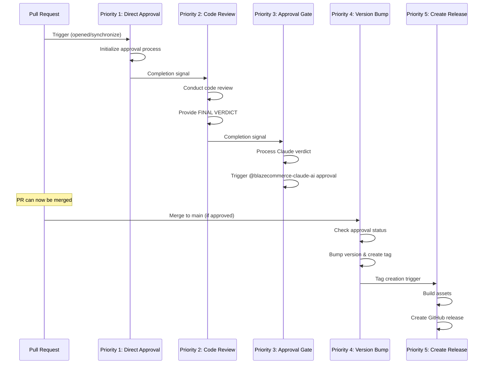

# GitHub Workflow Priority Restructuring Guide

## Overview

This document provides a comprehensive guide to the GitHub workflow priority restructuring implemented to resolve execution order issues and ensure proper dependencies between workflows.

## Problem Statement

### Issues Identified in PR #351

Based on [PR #351](https://github.com/blaze-commerce/blazecommerce-wp-plugin/pull/351) and related comments:

- **Comment #3067530964**: Direct approval workflow was running AFTER Claude review instead of BEFORE
- **Comment #3067531181**: Additional context showed workflow ordering problems
- **Root Cause**: Inconsistent priority naming and missing explicit dependencies

### Specific Problems

1. **Execution Order**: Claude Direct Approval should run BEFORE Claude Code Review
2. **Missing Dependencies**: Workflows lacked explicit `needs` declarations
3. **Race Conditions**: Version management workflows could conflict
4. **Inconsistent Naming**: Priority indicators were not standardized

## Solution Implementation

### New Priority Structure

| Priority | Workflow | Purpose | Dependencies |
|----------|----------|---------|--------------|
| **1** | 🔍 Claude Direct Approval | Initialize approval process | None (runs first) |
| **2** | 🤖 Claude AI Code Review | Review code and provide verdict | Waits for Priority 1 |
| **3** | ✅ Claude AI Approval Gate | Process approval and trigger @blazecommerce-claude-ai | Waits for Priority 2 |
| **4** | 🔢 Auto Version Bump | Bump versions (post-approval only) | Waits for Priority 3 + PR approval |
| **5** | 🚀 Create Release | Create GitHub release | Waits for Priority 4 |

### Key Implementation Features

#### 1. Explicit Dependencies

```yaml
# Example: Priority 2 waits for Priority 1
wait-for-priority-1:
  runs-on: ubuntu-latest
  timeout-minutes: 10
  steps:
    - name: Check Priority 1 Completion
      uses: actions/github-script@v7
      # Verifies Priority 1 workflow completed successfully
```

#### 2. Approval Enforcement

```yaml
# Priority 4 only runs after explicit PR approval
if: |
  github.ref == 'refs/heads/main' &&
  needs.wait-for-priority-3.outputs.pr-approved == 'true'
```

#### 3. Version Conflict Prevention

```yaml
- name: Pull Latest Changes to Prevent Version Conflicts
  run: |
    git fetch origin main
    git reset --hard origin/main
```

#### 4. Concurrency Management

```yaml
concurrency:
  group: priority-{N}-{workflow-name}-pr-{PR_NUMBER}
  cancel-in-progress: false  # Don't cancel to ensure completion
```

## Workflow Execution Flow



## Verification Steps

### 1. Test Workflow Execution Order

```bash
# Create test PR
git checkout -b test/workflow-priority-verification
echo "test" > test-file.txt
git add test-file.txt
git commit -m "test: verify workflow priority execution order"
git push origin test/workflow-priority-verification
```

### 2. Monitor GitHub Actions

1. Go to GitHub Actions tab
2. Verify workflows run in correct order:
   - 🔍 Priority 1: Claude Direct Approval (runs first)
   - 🤖 Priority 2: Claude AI Code Review (waits for Priority 1)
   - ✅ Priority 3: Claude AI Approval Gate (waits for Priority 2)

### 3. Test Approval Flow

1. Wait for Claude review with APPROVED verdict
2. Verify @blazecommerce-claude-ai approval is triggered
3. Confirm PR becomes mergeable
4. Test post-merge workflows (Priority 4 & 5)

## Troubleshooting

### Common Issues

1. **Workflow Not Triggering**
   - Check trigger conditions and branch patterns
   - Verify previous priority workflow completed successfully

2. **Dependency Timeout**
   - Increase timeout values in workflow variables
   - Check for stuck or failed dependency workflows

3. **Approval Gate Failing**
   - Ensure Claude AI provided APPROVED verdict in FINAL VERDICT section
   - Check for @blazecommerce-claude-ai approval

4. **Version Conflicts**
   - Verify latest changes are pulled before version operations
   - Check for concurrent version bump attempts

### Debug Information

Workflows now provide detailed logging:

```
DEBUG: Checking Priority 3 workflow completion...
SUCCESS: ✅ Priority 3: Claude AI Approval Gate completed with status: success
INFO: PR is approved by @blazecommerce-claude-ai - proceeding with version bump
```

## Benefits

### Immediate Benefits

1. **✅ Proper Execution Order**: Direct approval now runs before Claude review
2. **✅ No Race Conditions**: Explicit dependencies prevent conflicts
3. **✅ Version Consistency**: Conflict prevention ensures reliable version management
4. **✅ Clear Dependencies**: Each workflow knows what to wait for

### Long-Term Benefits

1. **✅ Reliable CI/CD**: Workflows execute predictably without manual intervention
2. **✅ Scalable Structure**: Easy to add new workflows with proper priorities
3. **✅ Clear Debugging**: Enhanced logging for troubleshooting
4. **✅ Maintainable Code**: Standardized naming and structure

## Related Documentation

- [Claude Workflow Sequence](./development/claude-workflow-sequence.md)
- [Workflow Configuration Guide](../workflow-configuration-guide.md)
- [GitHub Actions Best Practices](../github-actions-security-best-practices.md)

---

**Document Version**: 1.0  
**Created**: 2025-07-14  
**Author**: BlazeCommerce Development Team  
**Related PR**: [#351](https://github.com/blaze-commerce/blazecommerce-wp-plugin/pull/351)
